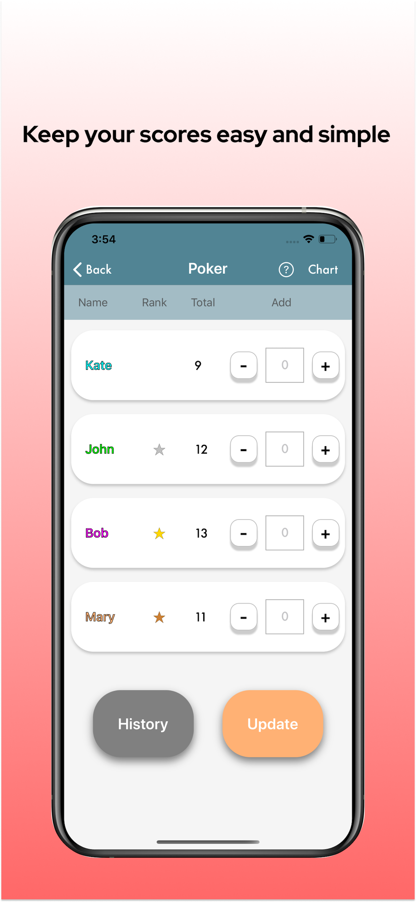
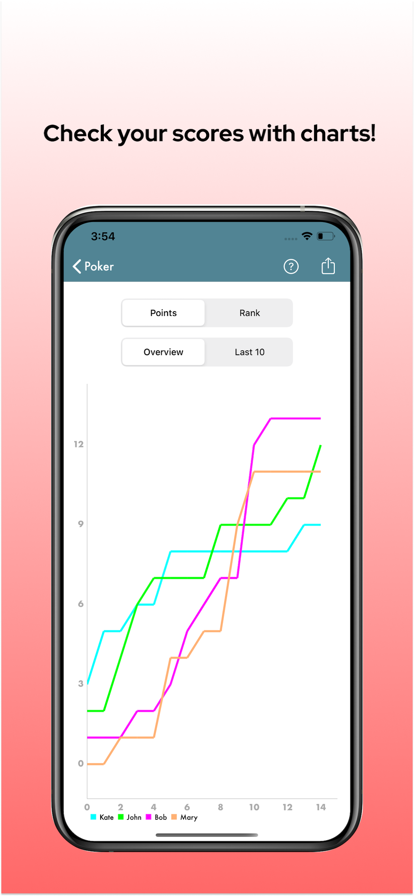
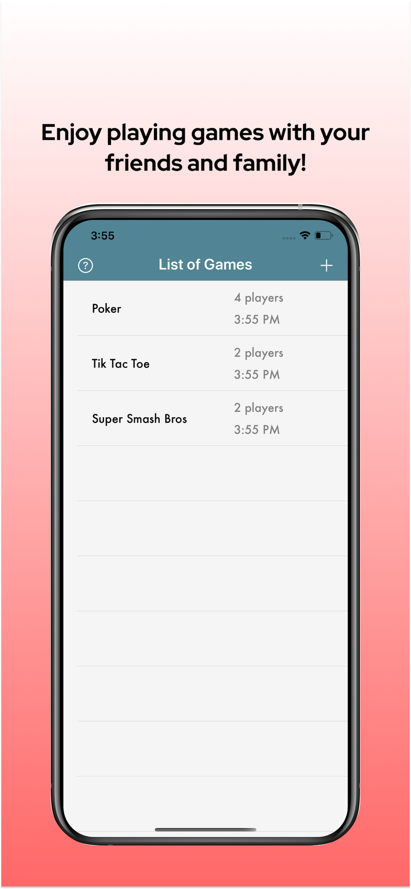

# Score-Tracker
IOS App that can record the scores for games
For download, please click the link the below.
https://apps.apple.com/jp/app/score-tracker/id1525870927

## Screen Shots

 
  
    
  

## Features
* trackes users' game score datas on their phone
* generate charts showing how the game points and ranks have changed (The generated charts can be exported)
* the scores the users entered in the past can be modified

## Language
Swift 5.1

## Third Party Libraries 
* [Charts](https://github.com/danielgindi/Charts)
* [freshOS/Stevia](https://github.com/freshOS/Stevia)

Thanks to the people that maintain these great libraries.

